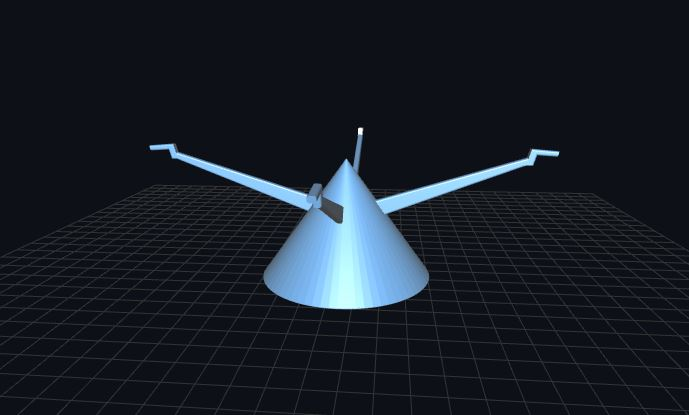

# Colector de orina
El bioterio del campus central de la universidad de San Carlos de Guatemala solicito el apoyo del FabLab-USAC para replicar una pieza que ellos utilizan para la recoleccion de orina de ratas, el laboratorio logro replicar esa pieza en un 95% el bioterio realizo sus pruebas pero
aun hace falta mejorar algunos aspectos de este dispositivo, el proyecto es en espera.

## Replica realizada por el FabLab-USAC
 
