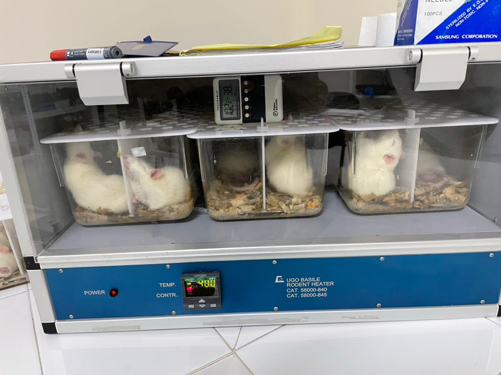

# Separadores de cajas
El bioterio del campus central de la universidad de San Carlos de Guatemala solicito el apoyo del FabLab-USAC para la elaboracion de un separador para una cajas que contienen ratones que son sometidos a estres mediante el incremento de temperaturas,
el FabLab-USAC propuso realizar los separadores en acrilico para que no se deformara al aplicar calor ya que una impresion 3D probablemente se deformaria.

El bioterio prototipo un diseño hecho de carton, a partir de ese prototipo el laboratorio lo modifico para que se pudiera realizar en acrilico y fuera lo mas rigido posible para que las ratas no lo desarmaran y escaparan.

## diseño final
 
 
