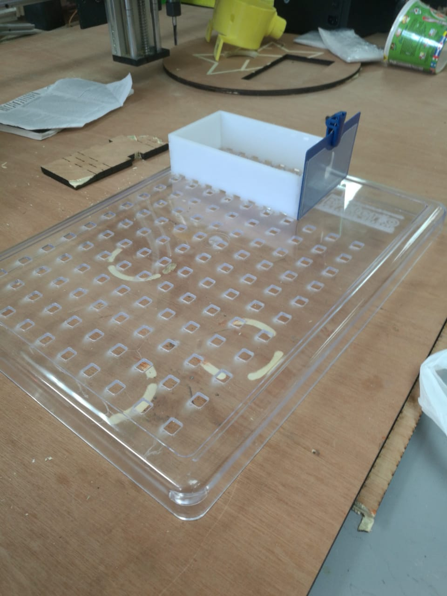
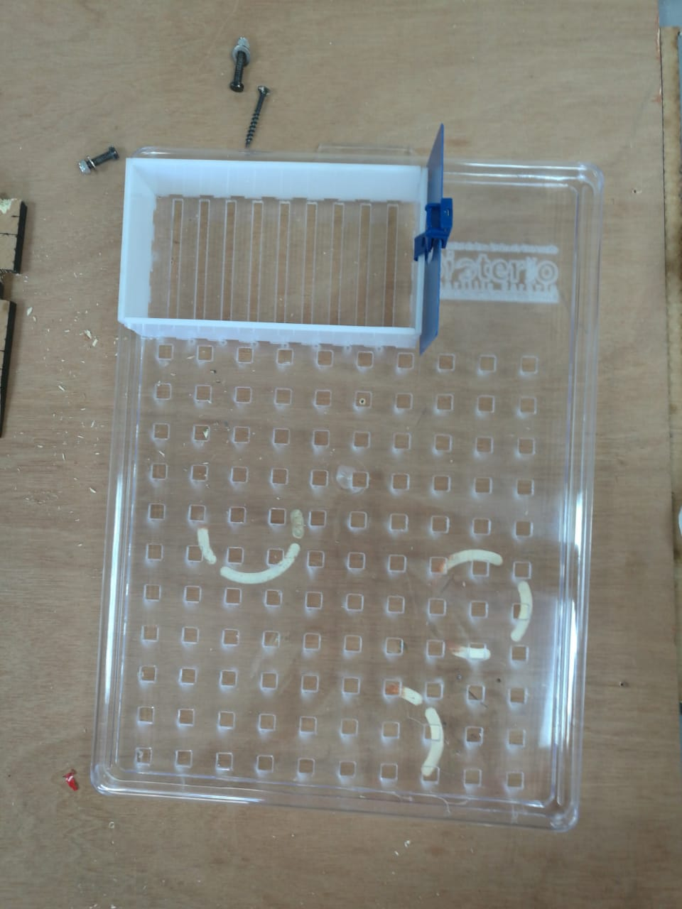
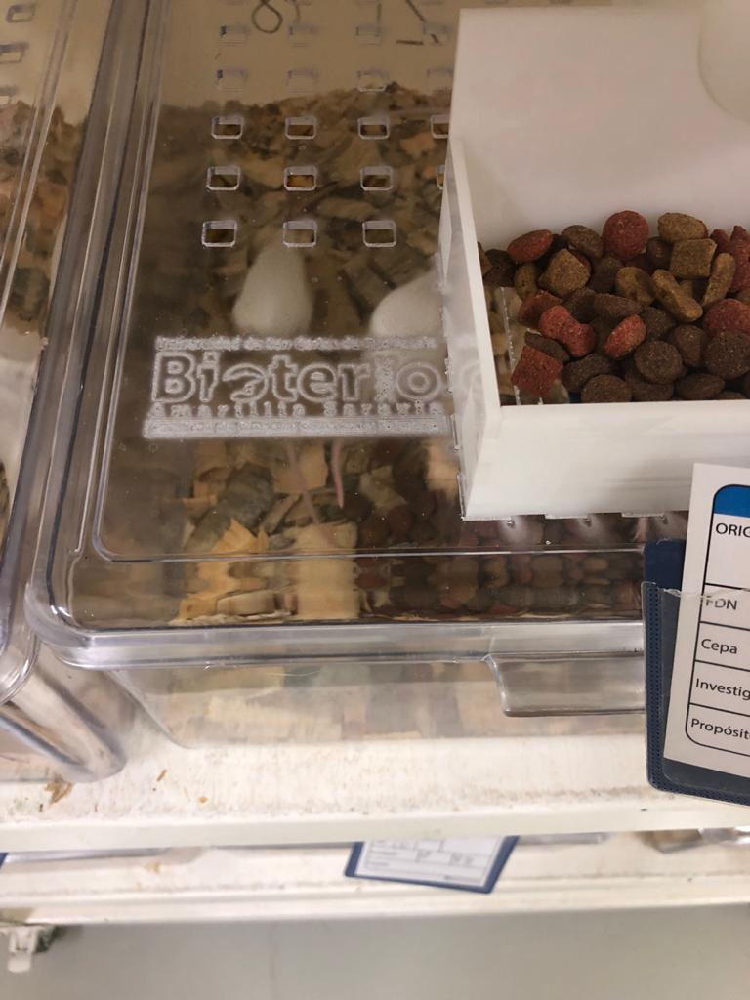
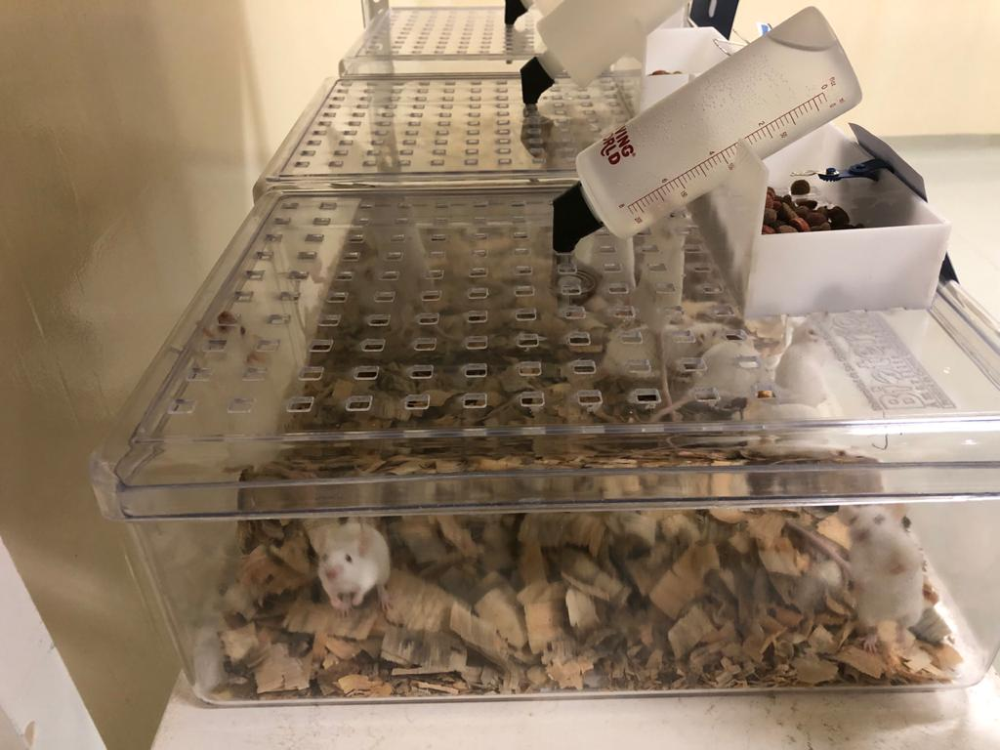
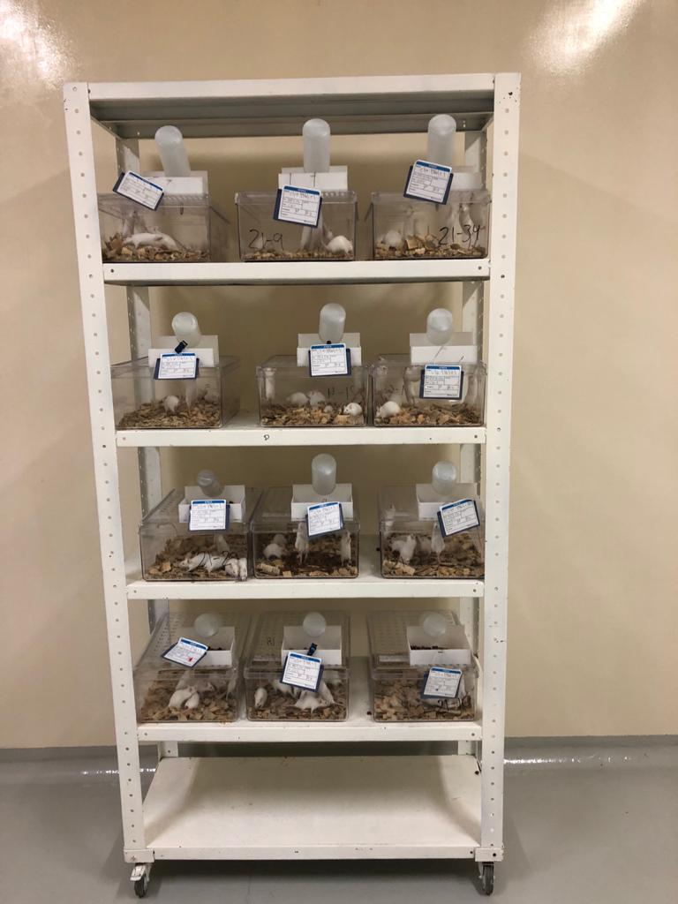

# Tapaderas para el Bioterio
El Bioterio del campues central solicito apoyo para la modificacion de unas tapaderas de plastico, las modificaciones solicitas fueron:
* Una matriz de cuadrados de 8mm aproximademente
* una regilla para que los ratones pudieran comer
* una caja para poder contener el concentrado de los ratones

Despues de realizar multiples pruebas se llego al siguiente resultado

 
 
 
 
 
