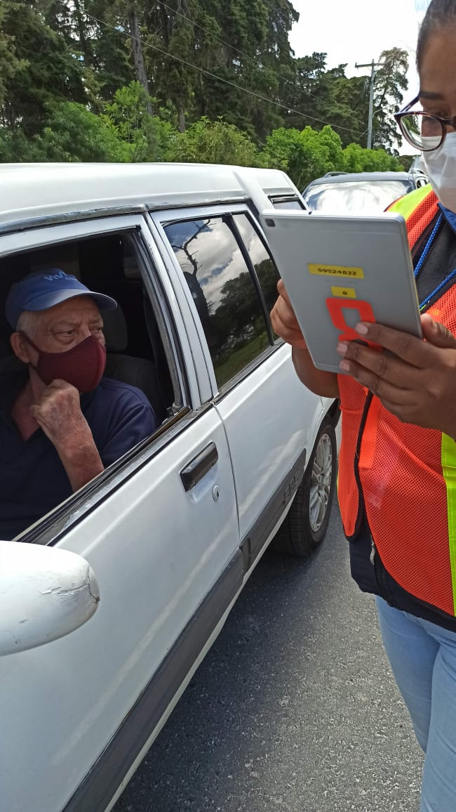

# Magneticos para la jornada de vacunacion
La direccion general de administracion de la universidad solicito apoyo para la fabricacion de unos magnetos para que lograran identificar la cantidad de personas que se van a vacunar en un vehiculo, se fabricos aproximadamente 1000 magnetos para apoyar con el control
de cuantas personas deben ser vacunadasa, esto para facilitar los controles en la jornada de vacunacion, tambien se apoyo con la fabricacion de numeros en vynil adesivo para identificar una tablet para que sea mas facil el conteo al final de cada jornada de vacunacion.

La direccion de general de administracion proporciono el material para la fabricacion de los magneticos, la fabricacion de los mismos se hizo atravez de una cortadora laser de CO2.

   
  

